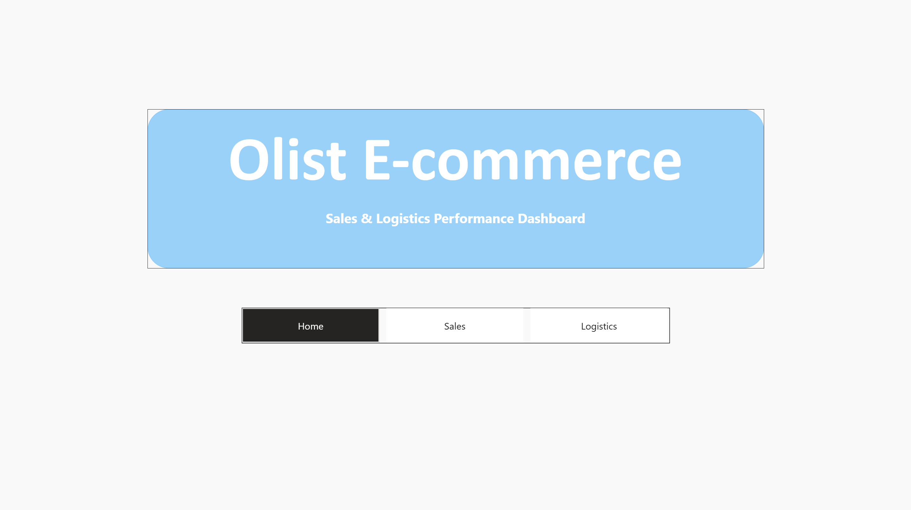
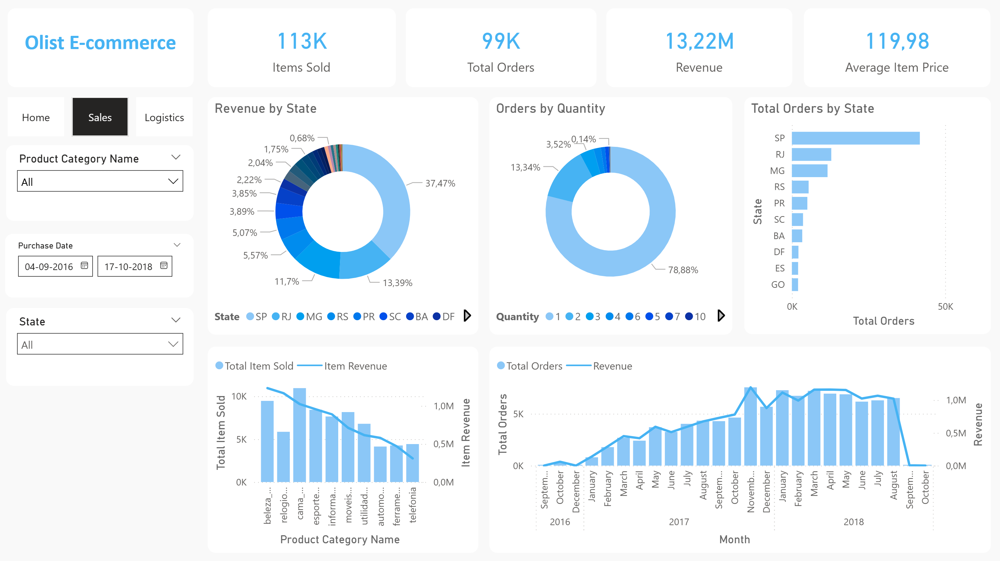
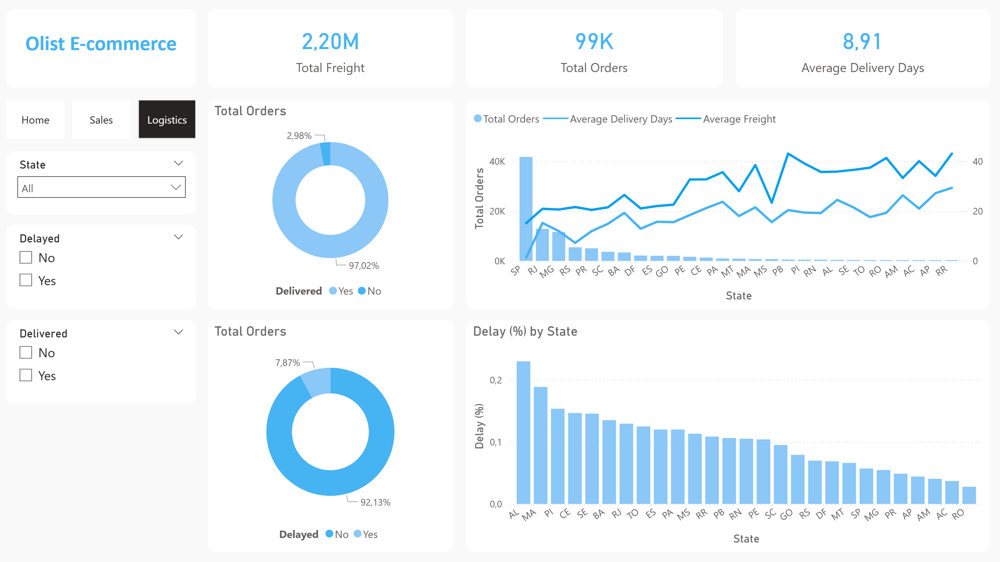

# Olist E-Commerce Analysis (End-to-End Project)

This project is an end-to-end data analysis of the Olist E-Commerce dataset from Kaggle, developed with the objective of simulating a real business analytics workflow, from raw data ingestion to interactive dashboards for decision-making.

The project covers the full data pipeline:
- Data ingestion and transformation
- Data modeling using a Data Warehouse approach
- SQL-based analysis
- Business metrics definition
- Interactive dashboards built in Power BI

The focus was not only on visualization, but also on data modeling, metric consistency, and business insights.

## Project Objective

The mais goal of this project was to perform a start to end analysis, meaning:
- Importing raw data
- Structuring and transforming it into analytical models
- Creating reliable KPIs
- Delivering dashboards that support sales and logistics decisions

This project was designed to mirror how analysts work in real-world business environments

## Tools & Technologies
- SQL Server - data storage, transformation, and modeling
- T-SQL - data cleaning, aggregation, and metric creation
- Power BI - data modeling, DAX measures, and dashboards
- GitHub - version control and project documentation

## Data Modeling
A Data Warehouse (DW) structure was implemented using a star schema, including:

### Fact Tables
- dw.fact_orders - order-level information (delivery days, delay flags, freight, status)
- dw.fact_sales_item - item-level sales data (price, quantity, revenue)

### Dimension Table
- dw.dim_customers - customer location (state, city)
- dw.dim_products - product and category information

This structure ensures:
- Consistent metrics
- Correct filter propagation
- High performance in Power BI

## Dashboards Overview

### Home Page
- Navigation to Sales and Logistics dashboards

### Sales Dashboard
Focused on commercial performance, including:
- Total Revenue
- Total Orders
- Total Items Sold
- Revenue by State
- Revenue and Quantity by Product Category
- Sales trends over time

### Logistics Dashboard
Focused on operational performance, including:
- Total Freight Cost
- Average Delivery Days
- Delivery and Delay Rates
- Delay (%) by State
- Relationship between delivery time, freight, and order volume

## Key Insights

### Sales Insights
- Revenue is highly concentrated in a small number of states, especially São Paulo (SP)
- A limited number of product categories generate the majority of revenue
- Most orders consist of small quantities, indicating consumer behavior focused on low-volume purchases
- Sales show a clear growth over time, especially between 2017 and 2018

### Logistics Insights
- The majority of oerders are successfully delivered on time, with delays representing a smaller share
- Delivery time and delay rates vary significantly by state, indicating regional logistics challenges
- Freight costs increase disproportionately in less central regions, impacting logistics efficiency

## Business Value
This analysis provides:
- Visilibity into sales concentration and customer behavior
- Identification of logistics bettlenecks by region
- Actionable insights for:
  - Imrpoving delivery performance
  - Optimizing freight costs
  - Supporting regional strategy decisions

## Data Source & Technical Notes
- The Power BI report is connected to a SQL Server local instance
- Because of this, the .pbix file requires access to the same database to refresh data
- Screenshots are provided to showcase the dashboards and insights

## Conclusion
This project demonstrates the ability to:
- Work across the entire data lifecycle
- Design and implement a data warehouse
- Write meaningful SQL transformations
- Build professional, business-ready dashboards
- Translate data into clear and actionable insights

## Dashboard Screenshots

### Home Page

### Sales Dashboard

### Logistics Dashboard

